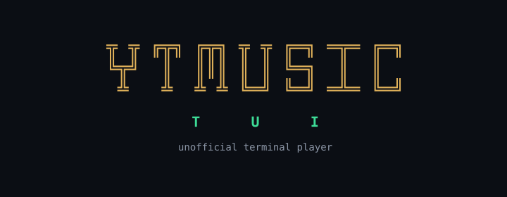

<p align="center">
  
</p>

# YTMusic TUI

A keyboard-driven, audio-only terminal music player for YouTube, built with Python, [Textual](https://github.com/Textualize/textual), [yt-dlp](https://github.com/yt-dlp/yt-dlp), and VLC.

Search YouTube, queue tracks, and keep local profiles and playlists — without leaving the terminal and without loading video.

> **Unofficial.** This is a personal hobby project and is not affiliated with, endorsed by, or sponsored by Google LLC, YouTube, or YouTube Music. Please read the [Disclaimer](#disclaimer) before using it.

---

## Features

- **Audio-only streaming**: resolves and plays the audio stream, so no bandwidth is spent on video.
- **Search-first TUI**: pick a profile on launch (or skip that screen in Settings); search is the landing mode and the now-playing bar stays visible in every mode.
- **Playback queue**: play, append, skip, remove, and save the queue as a playlist.
- **Local playlists**: create, edit, and open playlists backed by a local SQLite database.
- **Local profiles**: multiple profiles, each with its own preferences and playlists.

---

## Roadmap

- Alternate vim-style keys (`p` play, `H`/`L` modes), keeping the current map as default.
- Resume from the last position, and seeking within a track.
- Homebrew and Linux packages.
- Offline downloads and local-file playback.
- Algorithmic recommendations, possibly.

## Not implemented

- Metadata embedding.
- YouTube sign-in and library sync. Profiles are local; they are not YouTube accounts, so your YouTube library, likes, and history are out of reach.

---

## Requirements

- **Python** 3.11 or newer
- **VLC / libVLC** on the system — not installable from PyPI:

```bash
brew install --cask vlc                 # macOS
sudo apt install vlc                    # Debian/Ubuntu; other distros: the vlc package
```

On Windows, install [VLC](https://www.videolan.org/vlc/). Playback needs those system libraries and a working audio device, not just the `python-vlc` package.

---

## Installation

Any Python installer works. Pick one:

```bash
pipx install ytmusic-player-cli        # isolated app env
uv tool install ytmusic-player-cli     # same idea, if you have uv
pip install ytmusic-player-cli         # inside a virtualenv
pip install --user ytmusic-player-cli  # user site-packages
```

Then:

```bash
ytmusic-tui
```

From git:

```bash
pipx install git+https://github.com/hakanayaz14159/ytmusic-tui.git
```

`pip` and `uv tool` work the same way (`pip install git+https://...` or `pip install .`).

---

## Usage

```bash
ytmusic-tui            # launch the TUI
ytmusic-tui --version
ytmusic-tui --help
```

On launch, choose a profile (`enter` to continue, `n` for a new one). In Settings you can pick a startup profile and skip that screen. Press `?` in the player for the keymap: `1`–`5` switch modes and `/` jumps to the query field.

When YouTube breaks stream extraction, refresh yt-dlp with the same installer you used:

```bash
pipx upgrade ytmusic-player-cli
# or only yt-dlp:
pipx runpip ytmusic-player-cli install -U yt-dlp

# uv tool:
uv tool upgrade ytmusic-player-cli

# pip (venv or --user):
pip install -U ytmusic-player-cli
```

Profiles, playlists, and track metadata stay in a local SQLite file (`~/.local/share/ytmusic-tui/ytmusic.db` on Linux). There is no account, no server, and no telemetry.

```bash
YTMUSIC_LOG=1 ytmusic-tui   # optional debug log, next to the database
```

---

## Contributing

See [CONTRIBUTING.md](CONTRIBUTING.md).

---

## Disclaimer

**Not affiliated with Google.** YTMusic TUI is an independent, unofficial project. It is not affiliated with, endorsed by, sponsored by, or in any way officially connected to Google LLC, YouTube, or YouTube Music. "YouTube" and "YouTube Music" are trademarks of Google LLC and are used here only to describe what this software interoperates with.

**No accounts, no API keys.** The player does not use the YouTube Data API and never signs you in. It resolves publicly available audio streams through yt-dlp, exactly as yt-dlp would on the command line.

**Nothing is downloaded or redistributed.** Audio is streamed for playback only — no media files are written to disk, and this repository contains no media content.

**You are responsible for your own use.** Accessing YouTube is subject to [YouTube's Terms of Service](https://www.youtube.com/t/terms) and to the copyright law of your jurisdiction. This project is published for personal, educational use; make sure the way you use it is permitted where you are.

**Provided as-is.** The software comes with no warranty of any kind, as stated in the [MIT License](LICENSE). If YouTube changes how streams are served, playback can stop working without notice.

---

## Acknowledgements

Built on [Textual](https://github.com/Textualize/textual), [yt-dlp](https://github.com/yt-dlp/yt-dlp), [python-vlc](https://github.com/oaubert/python-vlc), [Peewee](https://github.com/coleifer/peewee), and [Click](https://github.com/pallets/click).

## License

MIT — see [LICENSE](LICENSE).
